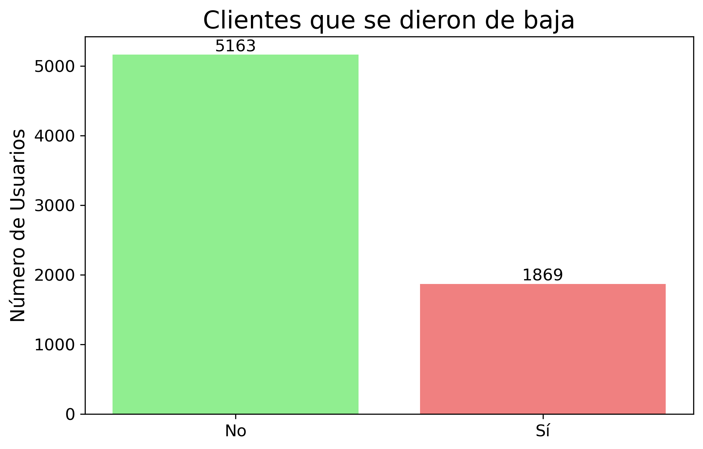
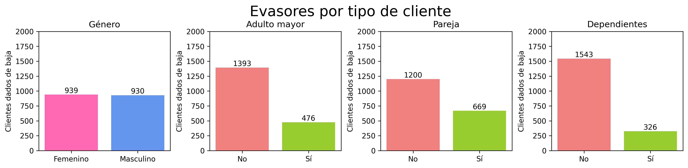
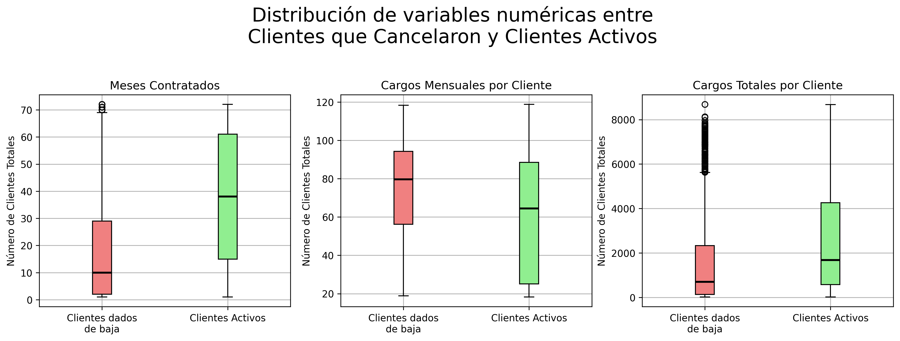

# Challenge-TelecomX
El desafío será recopilar, procesar y analizar los datos, utilizando Python y sus principales bibliotecas para extraer información valiosa. A partir del análisis, el equipo de Data Science podrá avanzar en modelos predictivos y desarrollar estrategias para reducir la evasión.

📄 Abre  el archivo `TelecomX_LATAM.ipynb` para visualizar el código y el informe final. 

# Cómo abrir el archivo `TelecomX_LATAM.ipynb`

1. Asegúrate de tener **Python** instalado en tu computadora.
2. Instala **Jupyter Notebook** ejecutando en la terminal: `pip install notebook`
3. Abre la **terminal** (o símbolo del sistema).
4. Dirígete a la carpeta donde se encuentra el archivo `.ipynb`.
5. Ejecuta el comando: `jupyter notebook`
6. Se abrirá Jupyter en tu navegador web.
7. Haz clic sobre el archivo **.ipynb** para abrirlo.

✅ El cuaderno quedará listo para usarse. ✨

## 📖 Diccionario de datos

- `customerID`: número de identificación único de cada cliente
- `Churn`: si el cliente dejó o no la empresa
- `gender`: género (masculino y femenino)
- `SeniorCitizen`: información sobre si un cliente tiene o no una edad igual o mayor a 65 años
- `Partner`: si el cliente tiene o no una pareja
- `Dependents`: si el cliente tiene o no dependientes
- `tenure`: meses de contrato del cliente
- `PhoneService`: suscripción al servicio telefónico
- `MultipleLines`: suscripción a más de una línea telefónica
- `InternetService`: suscripción a un proveedor de internet
- `OnlineSecurity`: suscripción adicional de seguridad en línea
- `OnlineBackup`: suscripción adicional de respaldo en línea
- `DeviceProtection`: suscripción adicional de protección del dispositivo
- `TechSupport`: suscripción adicional de soporte técnico, menor tiempo de espera
- `StreamingTV`: suscripción de televisión por cable
- `StreamingMovies`: suscripción de streaming de películas
- `Contract`: tipo de contrato
- `PaperlessBilling`: si el cliente prefiere recibir la factura en línea
- `PaymentMethod`: forma de pago
- `Charges.Monthly`: total de todos los servicios del cliente por mes
- `Charges.Total`: total gastado por el cliente

## ➗ El código se divide en 7 secciones:
1. 📌 Extracción

Se importaron los datos de la API de Telecom X. El archivo se encuentra disponible en este mismo repositorio con el nombre `TelecomX_Data`. Estos datos están disponibles en formato JSON y contienen información esencial sobre los clientes, incluyendo datos demográficos, tipo de servicio contratado y estado de evasión.

2. 🔧 Transformación 

En esta sección:
- Se comprende la estructura del dataset y el significado de sus columnas. Identificando variables relevantes para el análisis de evasión de clientes.
- Se verifica si hay problemas en los datos que puedan afectar el análisis como valores ausentes, duplicados, errores de formato e inconsistencias en las categorías.
- Se ajusta los datos para asegurar que estén completos y coherentes.
- Se estandarizaron y transformaron datos para facilitar el análisis. 

3. 📊 Carga y análisis

- Se realiza un análisis descriptivo de los datos, calculando métricas como media, mediana, desviación estándar y otras medidas que ayuden a comprender mejor la distribución y el comportamiento de los clientes.
- Se utilizan gráficos para visualizar la proporción de clientes que permanecieron y los que se dieron de baja. Ejemplo:
  
- Se explora cómo se distribuye la evasión según variables categóricas. Ejemplo:
  
- Se explora cómo las variables numéricas, como "total gastado" o "tiempo de contrato", se distribuyen entre los clientes que cancelaron (evasión) y los que no cancelaron. Ejemplo:
  

4. 📄 Informe final

En esta sección se redactó el informe final dentro del mismo notebook que resume todo el trabajo realizado.

## Autores
| [ Arithebunn](https://github.com/Arithebunn) |
| :---: | 
